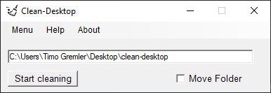

# clean-desktop
You ever found your desktop this messy, that you cant find specific file or just with long searching? 
This little helper tool will clean your desktop and sort all file into categorized folders.

# How does it work?
Download the latest release and launch the clean-desktop.exe or the clean-desktop.ps1.

The program will always create a "clean-desktop" folder, where all your file goes in. The default directory is the desktop. 
By checking "Move folders" it will move also the folders.  
 
You can easily extend the file extensions in the script, but this will not affect the clean-dekstop.exe!

# Which files are sorted by the program?
<table>
<tr><th>cleaning files </th></tr> 
<tr><td>

 |   Audio files |   Directory |    
 |  :-: |  :-: |    
 |  .aif |  media/audio |  
 |  .cda |  media/audio |  
 |  .mid |  media/audio |  
 |  .midi |  media/audio |  
 |  .mp3 |  media/audio |  
 |  .mpa |  media/audio |  
 |  .ogg |  media/audio |  
 |  .wav |  media/audio |  
 |  .wma |  media/audio |  
 |  .wpl |  media/audio |  
 |  .m3u |  media/audio |  

 |  Text files | Directory |  
 |  :-: |  :-: | 
 |  .txt |  text/text_files |  
 |  .doc |  text/microsoft/word |  
 |  .docx |  text/microsoft/word |  
 |  .odt |  text/text_files |  
 |  .pdf |  text/pdf |  
 |  .rtf |  text/text_files |  
 |  .tex |  text/text_files |  
 |  .wks |  text/text_files |  
 |  .wps |  text/text_files |  
 |  .wpd |  text/text_files |  

 |  Video files | Directory  |  
  |  :-: |  :-: | 
 |  .3g2 |  media/video |  
 |  .3gp |  media/video |  
 |  .avi |  media/video |  
 |  .flv |  media/video |  
 |  .h264 |  media/video |  
 |  .m4v |  media/video |  
 |  .mkv |  media/video |  
 |  .mov |  media/video |  
 |  .mp4 |  media/video |  
 |  .mpg |  media/video |  
 |  .mpeg |  media/video |  
 |  .rm |  media/video |  
 |  .swf |  media/video |  
 |  .vob |  media/video |  
 |  .wmv |  media/video |  

 |  Image files | Directory  |  
   |  :-: |  :-: | 
 |  .ai |  media/images |  
 |  .bmp |  media/images |  
 |  .gif |  media/images |  
 |  .jpg |  media/images |  
 |  .jpeg |  media/images |  
 |  .png |  media/images |  
 |  .ps |  media/images |  
 |  .psd |  media/images |  
 |  .svg |  media/images |  
 |  .tif |  media/images |  
 |  .tiff |  media/images |  
 |  .cr2 |  media/images |  

 |  Internet files | Directory   |  
   |  :-: |  :-: | 
 |  .asp |  other/internet |  
 |  .aspx |  other/internet |  
 |  .cer |  other/internet |  
 |  .cfm |  other/internet |  
 |  .cgi |  other/internet |  
 |  .pl |  other/internet |  
 |  .css |  other/internet |  
 |  .htm |  other/internet |  
 |  .js |  other/internet |  
 |  .jsp |  other/internet |  
 |  .part |  other/internet |  
 |  .php |  other/internet |  
 |  .rss |  other/internet |  
 |  .xhtml |  other/internet |  
 |  .html |  other/internet |  

 |  Compressed files | Directory   |  
   |  - |  - | 
 |  .7z |  other/compressed |  
 |  .arj |  other/compressed |  
 |  .deb |  other/compressed |  
 |  .pkg |  other/compressed |  
 |  .rar |  other/compressed |  
 |  .rpm |  other/compressed |  
 |  .tar.gz |  other/compressed |  
 |  .z |  other/compressed |  
 |  .zip |  other/compressed |

 |  Disc files | Directory   |  
   |  :-: |  :-: | 
 |  .bin |  other/disc |  
 |  .dmg |  other/disc |  
 |  .iso |  other/disc |  
 |  .toast |  other/disc |  
 |  .vcd |  other/disc |  

 |  Data files | Directory  |  
   |  :-: |  :-: | 
 |  .csv |  programming/database |  
 |  .dat |  programming/database |  
 |  .db |  programming/database |  
 |  .dbf |  programming/database |  
 |  .log |  programming/database |  
 |  .mdb |  programming/database |  
 |  .sav |  programming/database |  
 |  .sql |  programming/database |  
 |  .tar |  programming/database |  
 |  .xml |  programming/database |  
 |  .json |  programming/database |  

 |  Executables files | Directory   |  
   |  :-: |  :-: | 
 |  .apk |  other/executables |  
 |  .bat |  other/executables |  
 |  .com |  other/executables |  
 |  .exe |  other/executables |  
 |  .gadget |  other/executables |  
 |  .jar |  other/executables |  
 |  .wsf |  other/executables |  

 |  Font files | Directory   |  
   |  :-: |  :-: | 
 |  .fnt |  other/fonts |  
 |  .fon |  other/fonts |  
 |  .otf |  other/fonts |  
 |  .ttf |  other/fonts |  

 |   Presentation files | Directory   |  
   |  :-: |  :-: | 
 |  .key |  text/presentations |  
 |  .odp |  text/presentations |  
 |  .pps |  text/presentations |  
 |  .ppt |  text/presentations |  
 |  .pptx |  text/presentations |  

 |  Programming files | Directory  |  
   |  :-: |  :-: | 
 |  .c |  programming/c&c++ |  
 |  .class |  programming/java |  
 |  .java |  programming/java |  
 |   .py |   programming/python |   
 |  .sh |  programming/shell |  
 |  .h |  programming/c&c++ |  

 |  Spreadsheet files | Directory   | 
   |  :-: |  :-: |  
 |  .ods |  text/microsoft/excel |  
 |  .xlr |  text/microsoft/excel |  
 |  .xls |  text/microsoft/excel |  
 |  .xlsx |  text/microsoft/excel |  

 |   System files | Directory |  
   |  :-: |  :-: | 
 |  .bak |  text/other/system |  
 |  .cab |  text/other/system |  
 |  .cfg |  text/other/system |  
 |  .cpl |  text/other/system |  
 |  .cur |  text/other/system |  
 |  .dll |  text/other/system |  
 |  .dmp |  text/other/system |  
 |  .drv |  text/other/system |  
 |  .icns |  text/other/system |  
 |  .ico |  text/other/system |  
 |  .ini |  text/other/system |  
 |  .lnk |  text/other/system |  
 |  .msi |  text/other/system |  
 |  .sys |  text/other/system |  
 |  .tmp |  text/other/system |  

 |  Other |  Directory |  
   |  :-: |  :-: | 
 |  directory |  folders |  
 |  noname |  other/uncategorized |
</td></tr>
</table>
